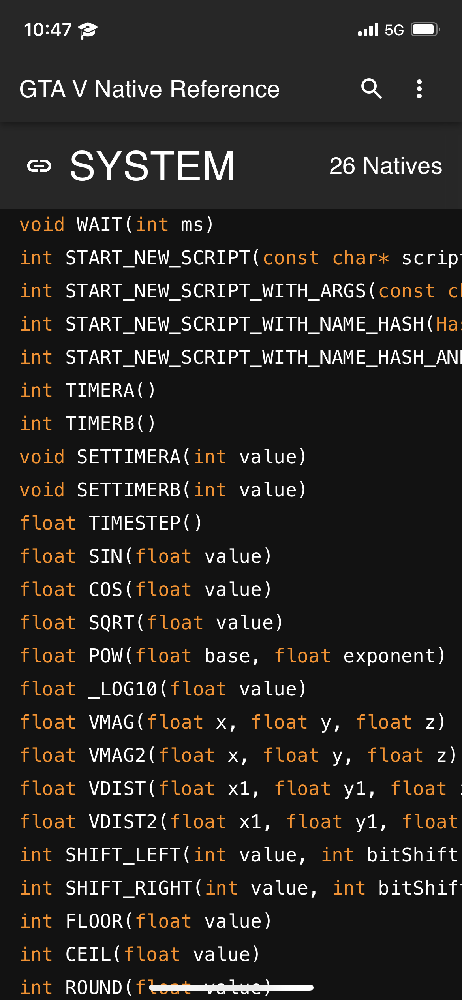
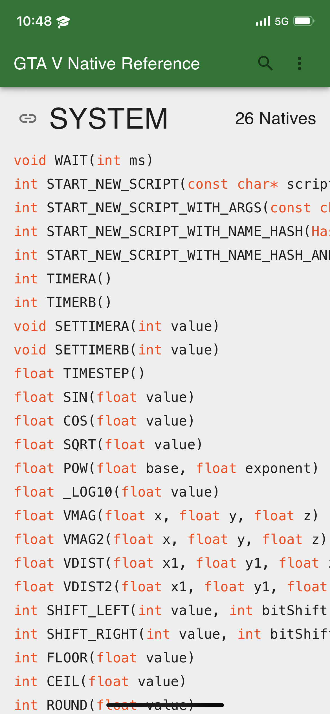
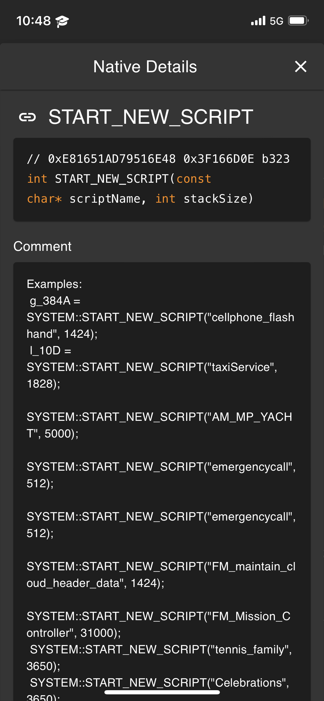

<div id="top"></div>

<!-- PROJECT SHIELDS -->
[![Contributors][contributors-shield]][contributors-url]
[![Forks][forks-shield]][forks-url]
[![Stargazers][stars-shield]][stars-url]
[![Issues][issues-shield]][issues-url]
[![MIT License][license-shield]][license-url]


<!-- PROJECT LOGO -->
<br />
<div align="center">
  <a href="https://github.com/DottieDot/GTAV-NativeDB">
    
  </a>

  <h1 align="center">Grand Theft Auto V Native Database</h3>

  <p align="center">
    A native database viewing client for Grand Theft Auto V
    <br />
    <br />
    <a href="https://nativedb.dotindustries.dev">Live Page</a>
    ·
    <a href="https://github.com/DottieDot/GTAV-NativeDB/issues">Report Bug</a>
    ·
    <a href="https://github.com/DottieDot/GTAV-NativeDB/issues">Request Feature</a>
  </p>
</div>


<!-- TABLE OF CONTENTS -->
<details>
  <summary>Table of Contents</summary>
  <ol>
    <li>
      <a href="#about-the-project">About The Project</a>
      <ul>
        <li><a href="#screenshots">Screenshots</a></li>
        <li><a href="#built-with">Built With</a></li>
      </ul>
    </li>
    <li>
      <a href="#getting-started">Getting Started</a>
      <ul>
        <li><a href="#prerequisites">Prerequisites</a></li>
        <li><a href="#installation">Installation</a></li>
        <li><a href="#local-development">Local Development</a></li>
      </ul>
    </li>
    <li><a href="#roadmap">Roadmap</a></li>
    <li><a href="#contributing">Contributing</a></li>
    <li><a href="#license">License</a></li>
    <li><a href="#contact">Contact</a></li>
    <li><a href="#acknowledgments">Acknowledgments</a></li>
  </ol>
</details>


<!-- ABOUT THE PROJECT -->
## About The Project

[![Desktop Interface Screenshot][desktop-dark-screenshot]](https://nativedb.dotindustries.dev)

A native reference for Grand Theft Auto V built with React. Inspired by FiveM's reference with a few improvements.

- Quickly jump to a namespace.
- Uses [Alloc8or's native data](https://github.com/alloc8or/gta5-nativedb-data) which is more up-to-date and has the correct naming for all of the namespaces.
- Ability to generate a native header file.
- The namespace name is sticky so you always know what namespace you're viewing.
- Works offline and is installable as a PWA.
- Mobile UI.
- FiveM natives (disabled by default).
- Script usage (disabled by default).
- Light and dark mode.


### Screenshots
<details>
  <summary>Show screenshots</summary>

  #### Desktop Dark
  ![Desktop dark interface screenshot][desktop-dark-screenshot]
  #### Desktop Light
  ![Desktop light interface screenshot][desktop-light-screenshot]

  #### Mobile Dark
  

  #### Mobile Light
  

  #### Mobile Native Info
  

</details>

<p align="right">(<a href="#top">back to top</a>)</p>

### Built With

This section should list any major frameworks/libraries used to bootstrap your project. Leave any add-ons/plugins for the acknowledgements section. Here are a few examples.

* [React.js](https://reactjs.org/)
* [Redux](https://redux.js.org)
* [Typescript](https://vuejs.org/)
* [MUI](https://mui.com/)

<p align="right">(<a href="#top">back to top</a>)</p>

<!-- GETTING STARTED -->
## Getting Started

This is an example of how you may give instructions on setting up your project locally.
To get a local copy up and running follow these simple example steps.

### Prerequisites

* nodejs
* npm

### Installation

1. Clone the repo
   ```sh
   git clone https://github.com/DottieDot/GTAV-NativeDB.git
   ```
2. Install NPM packages
   ```sh
   npm install
   ```

### Local development
1. Start development server
   ```sh
   npm start
   ```

<p align="right">(<a href="#top">back to top</a>)</p>

<!-- ROADMAP -->
## Roadmap

- [x] Update to new MUI
- [ ] Fix layout issues
- [ ] Provide Open Graph data
- [ ] SEO
- [ ] Code generation support for more languages

See the [open issues](https://github.com/DottieDot/GTAV-NativeDB/issues) for a full list of proposed features (and known issues).

<p align="right">(<a href="#top">back to top</a>)</p>

<!-- CONTRIBUTING -->
## Contributing

Contributions are what make the open source community such an amazing place to learn, inspire, and create. Any contributions you make are **greatly appreciated**.

If you have a suggestion that would make this better, please fork the repo and create a pull request. You can also simply open an issue with the tag "enhancement".
Don't forget to give the project a star! Thanks again!

1. Fork the Project
2. Create your Branch (`git checkout -b <branch name>`)
3. Commit your Changes (`git commit -m '<commit message>'`)
4. Push to the Branch (`git push origin <branch name>`)
5. Open a Pull Request

<p align="right">(<a href="#top">back to top</a>)</p>

<!-- LICENSE -->
## License

Distributed under the MIT License. See `LICENSE.txt` for more information.

<p align="right">(<a href="#top">back to top</a>)</p>

<!-- CONTACT -->
## Contact

To contact me refer to the socials on my Github profile:<br />
[https://github.com/DottieDot](https://github.com/DottieDot)

<p align="right">(<a href="#top">back to top</a>)</p>

<!-- ACKNOWLEDGMENTS -->
## Acknowledgments

* [Alloc8or's native data](https://github.com/alloc8or/gta5-nativedb-data)
* [FiveM's native data](https://github.com/citizenfx/fivem/tree/master/ext/native-decls)

<p align="right">(<a href="#top">back to top</a>)</p>

<!-- MARKDOWN LINKS & IMAGES -->
<!-- https://www.markdownguide.org/basic-syntax/#reference-style-links -->
[contributors-shield]: https://img.shields.io/github/contributors/DottieDot/GTAV-NativeDB.svg?style=for-the-badge
[contributors-url]: https://github.com/DottieDot/GTAV-NativeDB/graphs/contributors
[forks-shield]: https://img.shields.io/github/forks/DottieDot/GTAV-NativeDB.svg?style=for-the-badge
[forks-url]: https://github.com/DottieDot/GTAV-NativeDB/network/members
[stars-shield]: https://img.shields.io/github/stars/DottieDot/GTAV-NativeDB.svg?style=for-the-badge
[stars-url]: https://github.com/DottieDot/GTAV-NativeDB/stargazers
[issues-shield]: https://img.shields.io/github/issues/DottieDot/GTAV-NativeDB.svg?style=for-the-badge
[issues-url]: https://github.com/DottieDot/GTAV-NativeDB/issues
[license-shield]: https://img.shields.io/github/license/DottieDot/GTAV-NativeDB.svg?style=for-the-badge
[license-url]: https://github.com/DottieDot/GTAV-NativeDB/blob/master/LICENSE.txt

[issues-url]: https://github.com/DottieDot/GTAV-NativeDB/issues
[desktop-dark-screenshot]: screenshots/desktop_dark.png
[desktop-light-screenshot]: screenshots/desktop_light.png
[mobile-dark-screenshot]: screenshots/mobile_light.png
[mobile-light-screenshot]: screenshots/mobile_dark.png
[mobile-native-info-screenshot]: screenshots/mobile_native_info.png

